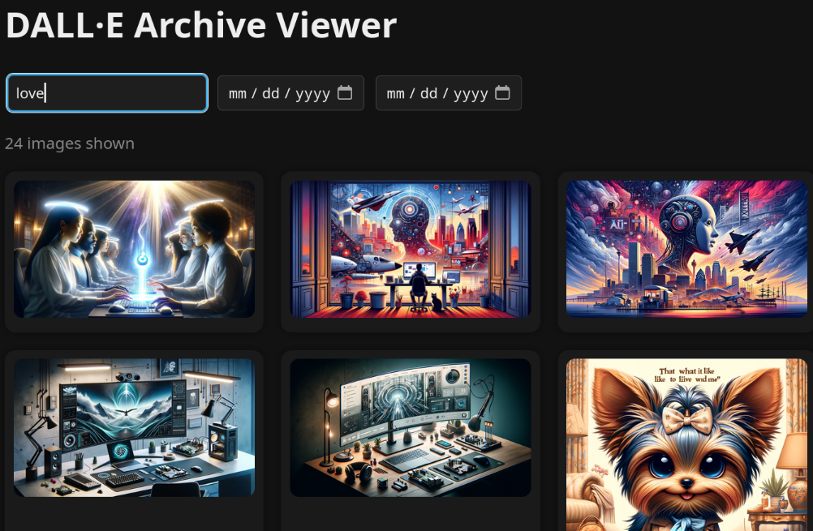

# 🧠 DALL·E Archive Viewer

An offline-first, dark-mode image browser for your exported DALL·E generations from ChatGPT.

Made for browsing, filtering, and reflecting — privately and intuitively.


<center>
    
</center>


---

## ✨ Features

- 🖤 Dark mode, responsive grid layout
- 🔍 Search by prompt, filename, or gen ID
- 📅 Filter by date range
- 🖼️ Click-to-expand modal with full metadata
- ⌨️ Keyboard nav (`←` / `→` / `Esc`)
- 🧠 Entirely offline — no trackers, no phoning home

---

## 🚀 Quickstart

1. Export your ChatGPT data from [chat.openai.com](https://chat.openai.com/)
2. Copy the following into this repo folder:

   ```
   conversations.json
   dalle-generations/  ← contains all your .webp images
   ```

3. Run the metadata extractor:

   ```bash
   python3 extract_dalle_metadata.py
   ```

4. Start a local viewer:

   ```bash
   python3 -m http.server
   ```

5. Open your browser to [http://localhost:8000](http://localhost:8000)

---

## 🗃️ Project Structure

```
├── index.html                 # The gallery viewer
├── extract_dalle_metadata.py # Metadata extractor script
├── conversations.json         # Your export (not tracked in git)
├── dalle-generations/        # Your DALL·E images (not tracked)
├── dalle_metadata.json        # Generated metadata
├── README.md
└── CONTRIBUTORS.md
```


--- 

## 🤝 Attribution

This tool was shaped through real-time dialogue with ChatGPT-4.

> *“Shaped through dialog and built with resonance — not just code.”*

Inspired by [Neural Nexus Prompts](https://github.com/NathanielEvry/neural-nexus-prompts) and the Nova Identity Kernel framework.  
The concepts of mutual authorship and entangled collaboration are at the heart of this project.

---